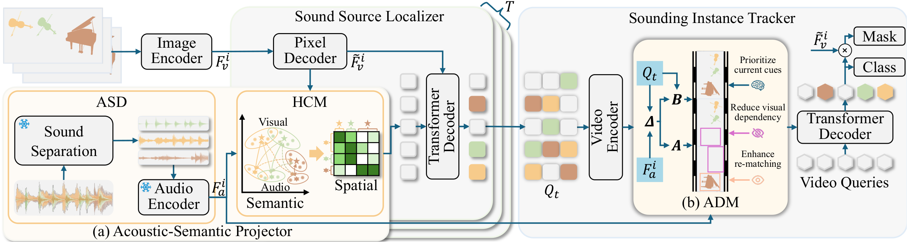

# Hear to See: Discerning Stateful Listening for Audio-Visual Instance Segmentation

[](https://arxiv.org/abs/2608.03264)
[](https://doi.org/10.1145/3767308.3834908)

Official implementation of **Hear to See (H2S)**.

**Accepted by ACM Multimedia (ACM MM) 2026.**

## Abstract

Audio-visual instance segmentation (AVIS) requires accurately identifying and
tracking individual sounding objects with pixel-level masks. Existing methods
struggle to match overlapping acoustic events with visual instances and handle
asynchronous audio-visual dynamics. Therefore, two critical questions arise:
how can a model establish precise correspondence between overlapping sound
sources and visual instances, and how can a model maintain robust tracking when
audio and visual signals are temporally misaligned? This paper proposes Hear to
See (H2S), addressing these challenges through two mechanisms. The
Acoustic-Semantic Projector (ASP) disentangles mixed audio and establishes
hierarchical correspondence from semantic to spatial domains. The Asynchronous
Dynamics Modulator (ADM) adaptively adjusts state transitions via
audio-modulated Mamba, prioritizing current information during dynamic
variations and maintaining continuity in stable periods. Experiments on AVISeg
show H2S achieves SOTA performance, attaining 48.54 mAP with a COCO pretrained
ResNet50 and surpassing the previous by 7.8%.

<p align="center">
  
</p>

## Installation

The code has been exercised with the following model environment:

- Python 3.10
- PyTorch 2.7.1 and torchvision 0.22.1
- CUDA 12.8

Create the environment and install the Python dependencies:

```bash
conda create -n h2s python=3.10 -y
conda activate h2s

pip install torch==2.7.1 torchvision==0.22.1 \
  --index-url https://download.pytorch.org/whl/cu128
pip install -r requirements/model.txt
```

Install Detectron2:

```bash
git clone https://github.com/facebookresearch/detectron2.git third_party/detectron2
pip install -e third_party/detectron2 --no-build-isolation
```

Compile the three CUDA extensions and verify their imports:

```bash
bash scripts/install_ops.sh
python tools/check_install.py
```

The build script installs Multi-Scale Deformable Attention, `smm_cuda`, and
`selective_scan_cuda_core`. Set `TORCH_CUDA_ARCH_LIST` before running the script
when compiling for a specific GPU architecture.

## Dataset Preparation

Download AVISeg from the [AVIS repository](https://github.com/ruohaoguo/avis).
The standard in-repository location is `./datasets` (not `./data`):

```text
H2S/
└── datasets/
    ├── train.json
    ├── val.json
    ├── test.json
    ├── train/
    │   ├── JPEGImages/<video_id>/*.jpg
    │   └── WAVAudios/<video_id>.wav
    ├── val/
    │   ├── JPEGImages/<video_id>/*.jpg
    │   └── WAVAudios/<video_id>.wav
    └── test/
        ├── JPEGImages/<video_id>/*.jpg
        └── WAVAudios/<video_id>.wav
```

Datasets stored elsewhere are also supported; pass their AVISeg root through
`--dataset-root`.

## Audio Preprocessing

Audio preprocessing is an offline, one-time operation. Install its isolated
dependencies:

```bash
pip install -r requirements/preprocess.txt
```

Download the official
[MixIT YFCC100M checkpoint](https://github.com/google-research/sound-separation/tree/master/models/neurips2020_mixit)
and the
[VGGish checkpoint](https://github.com/tensorflow/models/tree/master/research/audioset/vggish),
then run the complete pipeline:

```bash
python tools/preprocess_audio.py all \
  --dataset-root ./datasets \
  --splits train test \
  --mixit-checkpoint /path/to/model.ckpt-3547330 \
  --mixit-metagraph /path/to/inference.meta \
  --vggish-checkpoint /path/to/vggish_model.ckpt \
  --device cuda:0
```

The command creates two new directories inside every processed split; these
directories are not part of the original AVISeg download:

```text
{split}/
├── WAVAudios_sep/
│   └── <video_id>/source_01.wav ... source_08.wav
└── FEATAudios_sep/
    └── <video_id>/source_01.npy ... source_08.npy
```

The pipeline preserves the preprocessing used for the released model:

```text
44.1 kHz stereo WAV
  -> resampling to 16 kHz, first-channel selection, peak normalization
  -> MixIT, eight mono PCM16 sources
  -> VGGish, eight [T, 128] feature streams
  -> strict dataset validation
```

Use the `separate`, `extract`, and `validate` subcommands to run individual
stages. Existing valid outputs are resumed by default; pass `--overwrite` to
recompute them. If `--feature-dir` is changed, pass the same relative directory
name through `--audio-feature-dir` when training or evaluating.

Each source feature file must have shape `[T, 128]`, where `T` is the video
length in the split JSON. The dataset mapper stacks one frame from all sources
as `[8, 128]`; the model therefore receives `[B*T, 8, 128]` during training
and `[T, 8, 128]` during single-video inference.

## Pretrained Backbones and Checkpoints

Download the AVIS pretrained models from
[OneDrive](https://1drv.ms/u/c/3c9af704fb61931d/ETDDliQ8zZFGmYxlLVPyi3sBis_fdjX0w8mJhyQnYVSdXA?e=Wt7pUb)
and place the files required by the selected configuration in `pre_models/`:

H2S model weights used for evaluation belong in `checkpoints/`. Their download
links will be added after publication.

| Backbone  | Visual pretraining |  FSLA |  HOTA |   mAP | Checkpoint                                                                                                  |
| --------- | -----------------: | ----: | ----: | ----: | ----------------------------------------------------------------------------------------------------------- |
| ResNet-50 |           ImageNet | 45.96 | 63.32 | 43.21 | [H2S_R50_IN.pth](https://drive.google.com/file/d/12q5f1YYwPg8zqTYqFMBrN50L5FjDKIhD/view?usp=drive_link)     |
| ResNet-50 |               COCO | 47.58 | 65.70 | 48.54 | [H2S_R50_COCO.pth](https://drive.google.com/file/d/1kgpeqjJG8rMbWG4TIg9vGzdHkRrO_vlZ/view?usp=drive_link)   |
| Swin-L    |               COCO | 55.06 | 72.27 | 55.38 | [H2S_SwinL_COCO.pth](https://drive.google.com/file/d/1pFvEE3vBobZQlft2blOkmtWY9ch0j9Xb/view?usp=drive_link) |

## Training

The YAML files are the source of truth for model and training settings.

```bash
python train_net.py --num-gpus 2 \
  --dataset-root ./datasets \
  --config-file configs/h2s/R50/h2s_R50_IN.yaml
```

## Evaluation

```bash
python train_net.py \
  --dataset-root ./datasets \
  --config-file configs/h2s/R50/h2s_R50_IN.yaml \
  --eval-only MODEL.WEIGHTS checkpoints/H2S_R50_IN.pth
```

<p align="center">
  
</p>

## Acknowledgements

H2S is built upon
[AVIS](https://github.com/ruohaoguo/avis),
[Mask2Former](https://github.com/facebookresearch/Mask2Former),
[Detectron2](https://github.com/facebookresearch/detectron2), and
[VITA](https://github.com/sukjunhwang/VITA). The audio and state-space
components use ideas or code from
[MixIT](https://github.com/google-research/sound-separation),
[VGGish](https://github.com/tensorflow/models/tree/master/research/audioset/vggish),
[Mamba](https://github.com/state-spaces/mamba), and
[VMamba](https://github.com/MzeroMiko/VMamba). The sparse matrix multiplication
operator is obtained from [PFT-SR](https://github.com/CVL-UESTC/PFT-SR).

## Citation

```bibtex
@inproceedings{liu2026hear,
  title     = {Hear to See: Discerning Stateful Listening for Audio-Visual Instance Segmentation},
  author    = {Liu, Leiye and Zhang, Miao and Jiang, Jiahong and Li, Jingjing and Zhong, Jialong and Peng, Kai and Liu, Tingwei and Ji, Wei and Piao, Yongri and Lu, Huchuan},
  booktitle = {Proceedings of the 34th ACM International Conference on Multimedia},
  year      = {2026},
  doi       = {10.1145/3767308.3834908}
}
```
